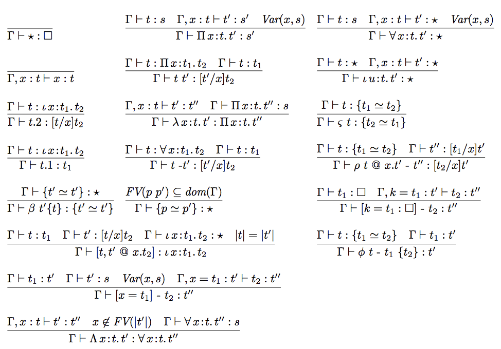

## Cedille-Core 

A minimal (600 LOC) programming language capable of proving theorems about its own terms.

## What that means?

There are big and small programming languages out there. C++ and Haskell are big languages. Other languages, such as [Brainfuck](https://en.wikipedia.org/wiki/Brainfuck), are so simple they could be implemented in [317 Python characters](https://codegolf.stackexchange.com/a/3085/7607). The [Lambda Calculus](https://en.wikipedia.org/wiki/Lambda_calculus) is popular for being a simple language that serves as the foundation of many functional programming languages.

Despite being turing-complete, there is one thing those languages can't do: expressing and proving mathematical theorems about its own terms. The few languages that can do that are rather big: [Idris](https://www.idris-lang.org/), [Agda](https://en.wikipedia.org/wiki/Agda_(programming_language)), [Coq](https://coq.inria.fr/) and [Isabelle](https://isabelle.in.tum.de/) are examples. Some languages like the [Calculus of Constructions](https://en.wikipedia.org/wiki/Calculus_of_constructions) (such as implemented on [Haskell-Morte-Library](https://github.com/Gabriel439/Haskell-Morte-Library)) are small and capable of expressing and proving mathematical theorems about its own terms, but, since their expressivity is very limited, they're not useful for proving useful properties about everyday programs and applications. Until recently, we had no language that was both small and featured practical theorem proving.

Cedille is a language developed by [Aaron Stump](http://homepage.divms.uiowa.edu/~astump/), aiming to solve that problem, among others. It is capable of proving useful theorems about its own terms, yet can be implemented in a very small amount of code. Cedille-Core is an attempt at implementing its core as tersely as possible.

## Typing rules

The rules are implemented as described on [this](spec.pdf) paper. Here is a preview:

## Disclaimer

This is just an initial attempt. It is fully untested, probably bug-ridden, certainly contains a lot of typos, etc. In fact, I'm still in the process of understanding Aaron's work, so chances are it has even deeper misunderstandings that could require major rewrites. This currently serves mostly as an initial step to better understand his work.
